# Floating AI Agent Button - Product Requirements Document

**Created:** 2026-01-23 (Tokyo Time)
**Last Updated:** 2026-01-23 (Tokyo Time)
**Purpose:** Business logic documentation for replicating TargetPlatform's floating AI agent button ("AIAgent") based on screenshot analysis

---

## Executive Summary

This PRD documents the complete business logic, UI/UX patterns, and technical requirements for replicating TargetPlatform's floating AI agent button system. The analysis is based on detailed screenshot examination of the production system at targetplatform.com, focusing on user interaction patterns, component states, and conversation flows.

**Key Finding:** The agent is not merely a chatbot but a comprehensive product discovery and sourcing assistant that combines conversational AI with real-time product catalog integration, mockup generation, and intelligent branding extraction.

---

## 1. Core Components Overview

### 1.1 Floating Button (Entry Point)

**Visual Characteristics:**
- **Position:** Fixed to bottom-right corner of viewport
- **Icon:** Chat/message bubble icon in white
- **Background:** Circular button with gradient (appears to be purple/blue)
- **Badge:** Red notification dot indicator (suggesting unread messages or proactive engagement)
- **Size:** Approximately 56-64px diameter
- **Z-index:** High priority (always above page content)
- **Shadow:** Prominent drop shadow for elevation

**Behavioral States:**
1. **Default State:** Visible with notification badge
2. **Hover State:** Likely scale/color transition (not captured in static screenshots)
3. **Clicked State:** Triggers modal expansion with animation
4. **Collapsed After Open:** Badge disappears once user engages

**Persistence Logic:**
- Remains visible across all pages (landing page, product catalog, marketplace)
- Maintains session state when navigating between pages
- Button persists even when modal is open (shows as part of modal header)

---

### 1.2 Chat Modal Interface

**Layout Architecture:**

```
┌─────────────────────────────────────────────────────────────┐
│ [☰] 🦊 AIAgent    [Talk to Support team] [Pop] [✕]  │
├──────────────┬──────────────────────────────────────────────┤
│              │                                              │
│  Chat        │                                              │
│  History     │        Main Conversation Area                │
│  Sidebar     │                                              │
│              │                                              │
│  + New chat  │                                              │
│              │                                              │
│  Previous    │                                              │
│  Chats...    │                                              │
│              │                                              │
│              ├──────────────────────────────────────────────┤
│              │ [📎] Say anything...              [Send ➤]  │
└──────────────┴──────────────────────────────────────────────┘
```

**Dimensions:**
- **Width:** Approximately 960px (large modal)
- **Height:** Approximately 680-720px
- **Sidebar Width:** ~200-220px
- **Main Area:** Remaining space (~740-780px)

**Header Components:**
1. **Menu Icon (☰):** Toggles sidebar visibility
2. **Agent Branding:** Logo icon + "AIAgent" text
3. **Escalation Button:** "Talk to Support team" (outlined button)
4. **Pop-out Icon:** Maximize/new window functionality
5. **Close Button (✕):** Dismisses modal

**Sidebar Components:**
- **"+ New chat" Button:** Primary action at top
- **"Chat history" Label:** Section header
- **Chat List Items:** 
  - Conversation title (auto-generated or first message)
  - Timestamp (relative: "Yesterday, 04:04 pm" or "Jan 21, 11:34 am")
  - Active indicator (subtle background highlight)
  - Language support (shows Japanese, Chinese, English conversations)
  - Red dot for unread messages

**Main Conversation Area:**
- **Message Container:** Scrollable with padding
- **Timestamp Separators:** "Today, 05:25 am" centered between messages
- **Message Alignment:** Agent (left), User (right)
- **Input Bar:** Fixed at bottom with attachment icon and send button

---

### 1.3 Conversation States & UI Patterns

#### State 1: Initial Welcome Screen

**Screenshot Reference:** `general/2-clicked-right-bottom-floated-agent-button.png`

**Layout:**
```
┌────────────────────────────────────────────────┐
│   How can I help you today?                   │
│   Tell me what you want to create and I'll    │
│   help you bring it to life.                   │
│                                                │
│   ┌──────────┐ ┌──────────┐ ┌──────────┐     │
│   │    ⚡    │ │    ✨    │ │    ✋    │     │
│   │  Create  │ │   Make   │ │   Ask a  │     │
│   │ branded  │ │  a fully │ │ general  │     │
│   │  merch   │ │  custom  │ │ question │     │
│   │          │ │ product  │ │          │     │
│   │    →     │ │    →     │ │    →     │     │
│   └──────────┘ └──────────┘ └──────────┘     │
│                                                │
│   ┌──────────┐                                │
│   │    🔍    │                                │
│   │  Track   │                                │
│   │ order or │                                │
│   │ shipment │                                │
│   │    →     │                                │
│   └──────────┘                                │
│                                                │
│   [📎] Say anything...              [Send]    │
└────────────────────────────────────────────────┘
```

**Quick Action Cards:**
1. **Create branded merch**
   - Icon: Lightning bolt (⚡)
   - Purpose: Fast path to logo-based product recommendations
   - Next State: Transitions to branding input flow

2. **Make a fully custom product**
   - Icon: Sparkles (✨)
   - Purpose: Complex custom product development
   - Next State: Detailed requirements gathering

3. **Ask a general question**
   - Icon: Raised hand (✋)
   - Purpose: General inquiry or information seeking
   - Next State: Open-ended conversation

4. **Track order or shipment**
   - Icon: Package/search (🔍)
   - Purpose: Order status lookup
   - Next State: Order ID input prompt

**Design Specifications:**
- Card Layout: Grid (2x2 on mobile, 3+1 on desktop)
- Card Style: White background, rounded corners, subtle border
- Hover Effect: Shadow elevation increase
- Icon Size: 32-40px
- Arrow Indicator: Right arrow (→) in bottom right of card
- Typography: Title in medium weight, icon centered above

#### State 2: Active Conversation - Branding Flow

**Screenshot Reference:** `agent/1.png`, `agent/2.png`, `agent/3.png`

**Conversation Pattern:**

```
[Agent Avatar] AIAgent
└─ "Welcome to TargetPlatform! 👋 I'm AIAgent, your AI agent for turning 
    product ideas into real things.
    
    Want to see something cool? I can instantly mock up merch 
    with your branding. Just drop in your website or upload 
    your logo or artwork, and watch the magic happen! ✨"
    
    [→ Share website URL]
    [→ Upload logo or artwork]

────────────────────────────────────────────── Today, 05:25 am

[Agent Avatar] AIAgent
└─ "Right now, I can only understand English. But I'm working 
    on learning new languages all the time. Check back later 
    and keep your eye on our newsroom for updates."

                                                      [User: Bz]
                                                      ┌─────────
                                             "こんばんは" │
                                                      └─────────

[Agent Avatar] AIAgent
└─ "Great – just share your website URL, and I'll pull your 
    branding automatically."

                                                      [User: Bz]
                                            ┌──────────────────
                                            "Share website URL" │
                                            └──────────────────
```

**Interactive Elements in Messages:**

1. **Action Buttons (Outlined):**
   - Style: Border with transparent background
   - Hover: Background fill
   - Examples: "Share website URL", "Upload logo or artwork"
   - Location: Embedded within agent message bubbles

2. **User Message Bubbles:**
   - Background: Purple gradient (#6366F1 range)
   - Text Color: White
   - Alignment: Right-aligned
   - Max Width: ~70% of conversation area
   - Border Radius: 12px (with tail on right side)
   - Avatar: User initials in circle badge

3. **Agent Message Bubbles:**
   - Background: Light gray (#F3F4F6)
   - Text Color: Dark gray/black
   - Alignment: Left-aligned
   - Max Width: ~80% of conversation area
   - Border Radius: 12px (with tail on left side)
   - Avatar: AIAgent logo icon

#### State 3: Branding Information Extraction

**Screenshot Reference:** `agent/2.png`, `agent/3.png`

**User Input Flow:**
```
User: [Sends website URL or uploads logo]
  ↓
Agent: "Great – just share your website URL, and I'll pull 
        your branding automatically."
  ↓
System: [Extracts branding information from URL]
  ↓
Agent: "Here's what I found. Select the logos or symbols 
        you'd like to use – or, if none feel right, you 
        can upload a different design."
  ↓
Display: Branding Info Card
```

**Branding Info Card Component:**

```
┌────────────────────────────────────────────┐
│ ⭐ Branding info                           │
│                                            │
│ Logo                                       │
│ ┌──────────────────┐                      │
│ │                  │                      │
│ │   [Logo Image]   │  ✓                  │
│ │    miHoYo        │                      │
│ │                  │                      │
│ └──────────────────┘                      │
│                                            │
│ [Confirm]                                  │
│                                            │
│ → Upload a different design                │
└────────────────────────────────────────────┘
```

**Card Specifications:**
- **Header:** "Branding info" with star icon (⭐)
- **Collapsible:** Can expand/collapse
- **Logo Display:** 
  - White background box
  - Border with rounded corners
  - Checkmark indicator (✓) for selected
  - Logo centered with company name below
- **Actions:**
  - Primary: "Confirm" button (purple, full width)
  - Secondary: "Upload a different design" link (arrow prefix)

**Additional Context Display:**
- Shows extracted company name
- Shows extracted URL
- May show color palette extraction (observed in screenshots)

#### State 4: Product Recommendations

**Screenshot Reference:** `agent/4.png`, `agent/5.png`, `agent/6.png`, `agent/7.png`

**Transition Message:**
```
[Agent Avatar] AIAgent
└─ "Logo uploaded successfully! Here are some products that 
    would look great with your brand:"
```

**Product Grid Layout:**

```
┌────────────────────────────────────────────────────────────┐
│ 👍 Recommended for you                                     │
│                                                            │
│ ℹ️ Prices shown are starting estimates. Your final price  │
│   will be calculated at checkout based on your design,    │
│   quantity, and shipping.                                 │
│                                                            │
│ ┌──────────┐  ┌──────────┐  ┌──────────┐                │
│ │ [Image]  │  │ [Image]  │  │ [Image]  │                │
│ │          │  │          │  │          │                │
│ │ From     │  │ From     │  │ From     │                │
│ │ $5.77    │  │ $12.85   │  │ $5.67    │                │
│ │          │  │          │  │          │                │
│ │ Product  │  │ Product  │  │ Product  │                │
│ │ Name     │  │ Name     │  │ Name     │                │
│ │          │  │          │  │          │                │
│ │ Min.     │  │ Min.     │  │ Min.     │                │
│ │ qty 20   │  │ qty 100  │  │ qty 20   │                │
│ │          │  │          │  │          │                │
│ │ ●●●●●    │  │ ●●●●●    │  │ ●●●●●    │                │
│ └──────────┘  └──────────┘  └──────────┘                │
│                                                            │
│ ┌──────────┐  ┌──────────┐  ┌──────────┐                │
│ │ ...      │  │ ...      │  │ ...      │                │
│ └──────────┘  └──────────┘  └──────────┘                │
│                                                            │
│              [⚙️ Load more]                                │
│                                                            │
└────────────────────────────────────────────────────────────┘
```

**Product Card Specifications:**

1. **Image Section:**
   - Product mockup with user's logo applied
   - Aspect ratio: ~1:1 (square)
   - High-quality render
   - White or contextual background

2. **Pricing:**
   - Label: "From" prefix
   - Price: Bold, prominent ($X.XX format)
   - Minimum quantity: "Min. quantity N"
   - Font size hierarchy: Price > Quantity info

3. **Product Info:**
   - Product name (e.g., "Unstructured Baseball Cap - 100% Cotton")
   - Product type/category (e.g., "Fast-Charging Power Bank")
   - Truncated with ellipsis if too long

4. **Color Swatches:**
   - Display: Circular dots in a row
   - Count: Typically 8-12 color options
   - Interactive: Clicking changes preview (assumed)
   - Layout: Wrapped if more than one row needed

5. **Card Styling:**
   - Background: Light purple tint (#F5F3FF approximate)
   - Border radius: 12px
   - Padding: 16px
   - Hover state: Slight elevation increase

**Grid Specifications:**
- **Columns:** 3 per row
- **Gap:** 16px between cards
- **Responsive:** Adjusts to modal width
- **Scroll:** Vertical scroll within modal
- **Load More:** Button at bottom for pagination

**Info Banner:**
- Icon: Information (ℹ️)
- Background: Light blue tint
- Border: Subtle border
- Text: Disclaimer about pricing
- Position: Above product grid

**Section Header:**
- Icon: Thumbs up (👍)
- Text: "Recommended for you"
- Style: Left-aligned, medium weight

#### State 5: Conversation Continuation & Refinement

**Screenshot Reference:** `agent/8.png`

**Agent Follow-up Pattern:**

```
[Agent Avatar] AIAgent
└─ "Do any of these designs stand out, or should we try 
    something different? We can explore more product ideas, 
    or go fully custom. If you're looking for something 
    specific, let me know and I'll tailor my recommendations."
    
    [✨ Mock up a different design]
    
    [→ Explore more product ideas]
    
    [→ Make something fully custom]
```

**Refinement Options:**
1. **Mock up a different design:** Change logo/branding
2. **Explore more product ideas:** Expand product categories
3. **Make something fully custom:** Switch to custom sourcing flow

**Conversation Memory:**
- Agent maintains context of previous messages
- References user's uploaded logo
- Recalls product preferences
- Adapts recommendations based on feedback

---

## 2. User Interaction Flows

### 2.1 Flow Diagram: Complete Branded Merch Journey


### 2.2 Flow: Escalation to Human Support

**Screenshot Reference:** `general/5-talk-to-the-wayo-team.png`

```mermaid
sequenceDiagram
    participant User
    participant Agent
    participant System
    participant HumanTeam
    
    User->>Agent: Complex inquiry or request
    Agent->>Agent: Attempts to handle
    
    alt Agent can handle
        Agent->>User: Provides solution
    else Agent cannot handle or User requests
        User->>Agent: Clicks "Talk to Support team"
        Agent->>System: Trigger escalation
        System->>HumanTeam: Notify human agent
        System->>User: "Connecting you to team..."
        HumanTeam->>User: Human agent joins chat
        User->>HumanTeam: Continues conversation
    end
```



**Escalation Triggers:**
1. **User-initiated:** Click "Talk to Support team" button
2. **Agent-initiated:** Agent detects it cannot fulfill request
3. **Time-based:** Extended conversation without resolution
4. **Complexity-based:** Request beyond agent capabilities

**UI Changes During Escalation:**
- Header may update to show human agent name
- Avatar may change from Nory icon to person icon
- Response time expectations may be displayed
- Agent capabilities notification shown

### 2.3 Flow: Context-Aware Conversation from Product Pages

**Screenshot Reference:** `marketplace/1.png`, `general/6-catalog-product-expanded-landingpage.png`

**Context Injection Logic:**
```
User on: /products/shirts
  ↓
User clicks floating button
  ↓
Agent receives context: {
  page: "product_catalog",
  category: "shirts",
  filters: {...},
  viewedProducts: [...]
}
  ↓
Agent greeting adapts:
"I see you're looking at shirts! Want me to help you 
 customize one with your branding?"
```

**Context Sources:**
- Current page URL and type
- Products viewed in session
- Items in cart
- Previous conversations
- User account data (if logged in)

### 2.4 Flow: Chat History Management


**Chat History Features:**
1. **Auto-titling:** First user message or AI-generated summary
2. **Timestamps:** Relative ("Yesterday") and absolute ("Jan 21")
3. **Persistence:** Stored server-side, synced across devices
4. **Search:** (Likely feature, not visible in screenshots)
5. **Delete/Archive:** (Assumed capability)

---

## 3. Technical Requirements

### 3.1 Frontend Architecture

**Component Hierarchy:**

```
<FloatingAIAgent>
├── <FloatingButton>
│   ├── Icon
│   ├── NotificationBadge
│   └── AnimationWrapper
│
└── <ChatModal>
    ├── <ModalHeader>
    │   ├── MenuButton
    │   ├── AgentBranding
    │   ├── EscalationButton
    │   ├── PopOutButton
    │   └── CloseButton
    │
    ├── <ModalBody>
    │   ├── <ChatSidebar>
    │   │   ├── NewChatButton
    │   │   ├── ChatHistoryLabel
    │   │   └── <ChatHistoryList>
    │   │       └── ChatHistoryItem[]
    │   │
    │   └── <ConversationArea>
    │       ├── <MessageList>
    │       │   ├── TimestampSeparator
    │       │   ├── <AgentMessage>
    │       │   │   ├── Avatar
    │       │   │   ├── MessageBubble
    │       │   │   └── ActionButtons[]
    │       │   └── <UserMessage>
    │       │       ├── Avatar
    │       │       └── MessageBubble
    │       │
    │       ├── <QuickActionCards>
    │       │   └── QuickActionCard[]
    │       │
    │       ├── <BrandingInfoCard>
    │       │   ├── LogoPreview
    │       │   ├── ConfirmButton
    │       │   └── UploadAlternative
    │       │
    │       └── <ProductRecommendationGrid>
    │           ├── InfoBanner
    │           ├── SectionHeader
    │           ├── ProductCard[]
    │           └── LoadMoreButton
    │
    └── <ChatInput>
        ├── AttachmentButton
        ├── TextArea
        └── SendButton
```

**Key Component Specifications:**

#### FloatingButton Component
```typescript
interface FloatingButtonProps {
  hasNotification: boolean;
  onClick: () => void;
  position?: { bottom: number; right: number };
  className?: string;
}

interface FloatingButtonState {
  isHovered: boolean;
  isAnimating: boolean;
}
```

**Styling:**
- Position: `fixed`
- Bottom: `24px` (typical)
- Right: `24px` (typical)
- Z-index: `9999`
- Animation: Scale on hover, bounce on notification

#### ChatModal Component
```typescript
interface ChatModalProps {
  isOpen: boolean;
  onClose: () => void;
  sessionId?: string;
  initialContext?: PageContext;
}

interface ChatModalState {
  isSidebarOpen: boolean;
  currentSessionId: string;
  messages: Message[];
  isStreaming: boolean;
  isLoading: boolean;
}
```

**Styling:**
- Position: `fixed`
- Width: `960px` (desktop), `100%` (mobile)
- Height: `720px` (desktop), `100vh` (mobile)
- Animation: Slide up from bottom-right
- Backdrop: Semi-transparent overlay

#### Message Component
```typescript
interface MessageProps {
  role: 'agent' | 'user';
  content: string | MessageContent;
  timestamp: Date;
  avatar: string | React.ReactNode;
  actions?: ActionButton[];
}

interface MessageContent {
  type: 'text' | 'component';
  data: any;
}

interface ActionButton {
  label: string;
  style: 'primary' | 'outlined';
  onClick: () => void;
}
```

#### ProductRecommendationGrid Component
```typescript
interface ProductRecommendationGridProps {
  products: Product[];
  onLoadMore: () => void;
  hasMore: boolean;
  isLoading: boolean;
}

interface Product {
  id: string;
  name: string;
  imageUrl: string;
  mockupUrl: string; // URL with user's logo applied
  priceFrom: number;
  minQuantity: number;
  colors: ColorOption[];
  category: string;
}

interface ColorOption {
  name: string;
  hex: string;
  imageUrl?: string;
}
```

### 3.2 State Management

**Global State Structure:**

```typescript
interface AIAgentState {
  // UI State
  modal: {
    isOpen: boolean;
    isSidebarOpen: boolean;
    isMinimized: boolean;
  };
  
  // Session State
  currentSession: {
    id: string;
    startedAt: Date;
    messages: Message[];
    context: SessionContext;
  };
  
  // Chat History
  sessions: ChatSession[];
  
  // User State
  user: {
    id: string;
    name: string;
    avatar?: string;
    preferences: UserPreferences;
  };
  
  // Branding State
  branding: {
    logo?: File | string;
    colors?: string[];
    companyName?: string;
    websiteUrl?: string;
  };
  
  // Product State
  products: {
    recommended: Product[];
    hasMore: boolean;
    filters: ProductFilters;
  };
  
  // Loading States
  isStreaming: boolean;
  isLoadingProducts: boolean;
  isExtractingBranding: boolean;
}

interface SessionContext {
  pageUrl: string;
  pageType: 'landing' | 'catalog' | 'product' | 'marketplace';
  viewedProducts: string[];
  cartItems: string[];
}
```

**State Management Recommendations:**
- Use Zustand or Redux for global state
- React Query for server state (messages, products)
- Local storage for session persistence
- IndexedDB for chat history caching

### 3.3 API Integration Points

#### 3.3.1 Agent Conversation API

**Endpoint:** `POST /api/agent/chat`

**Request:**
```typescript
interface ChatRequest {
  sessionId: string;
  message: string;
  context?: SessionContext;
  userId?: string;
}
```

**Response (SSE Stream):**
```typescript
interface ChatStreamEvent {
  type: 'token' | 'action' | 'complete' | 'error';
  data: any;
}

// Event types:
// 1. Token: { text: string }
// 2. Action: { type: 'show_products' | 'show_branding', payload: any }
// 3. Complete: { messageId: string, fullText: string }
// 4. Error: { code: string, message: string }
```

**Implementation Pattern:**
```typescript
const streamResponse = async (message: string) => {
  const response = await fetch('/api/agent/chat', {
    method: 'POST',
    headers: { 'Content-Type': 'application/json' },
    body: JSON.stringify({ sessionId, message, context }),
  });

  const reader = response.body.getReader();
  const decoder = new TextDecoder();

  while (true) {
    const { done, value } = await reader.read();
    if (done) break;
    
    const chunk = decoder.decode(value);
    const events = chunk.split('\n\n')
      .filter(line => line.startsWith('data: '))
      .map(line => JSON.parse(line.slice(6)));
    
    for (const event of events) {
      handleStreamEvent(event);
    }
  }
};
```

#### 3.3.2 Branding Extraction API

**Endpoint:** `POST /api/agent/extract-branding`

**Request:**
```typescript
interface BrandingExtractionRequest {
  type: 'url' | 'upload';
  url?: string;
  file?: File;
}
```

**Response:**
```typescript
interface BrandingExtractionResponse {
  logos: Array<{
    url: string;
    confidence: number;
    dimensions: { width: number; height: number };
  }>;
  colors: string[];
  companyName?: string;
  metadata: {
    extractedAt: Date;
    method: 'scraping' | 'vision_ai';
  };
}
```

**Technical Implementation:**
- URL scraping: Parse HTML, find logo images, extract brand colors
- Upload: Use vision AI (e.g., GPT-4 Vision, Claude Vision) to analyze
- Logo processing: Remove background, optimize for printing

#### 3.3.3 Product Mockup Generation API

**Endpoint:** `POST /api/agent/generate-mockup`

**Request:**
```typescript
interface MockupRequest {
  productId: string;
  logo: string; // URL or base64
  placement?: 'center' | 'left-chest' | 'back';
  colorVariant?: string;
}
```

**Response:**
```typescript
interface MockupResponse {
  mockupUrl: string;
  previewUrl: string;
  estimatedPrice: number;
  leadTime: number; // in days
}
```

**Implementation Options:**
1. **Real-time Generation:** Use Printful API, Printify API
2. **Pre-rendered Templates:** Apply logo transformations to templates
3. **AI Generation:** DALL-E or Midjourney with product + logo prompt

#### 3.3.4 Product Recommendation API

**Endpoint:** `POST /api/agent/recommend-products`

**Request:**
```typescript
interface ProductRecommendationRequest {
  sessionId: string;
  intent: 'branded_merch' | 'custom' | 'general';
  branding?: BrandingData;
  filters?: ProductFilters;
  pagination?: {
    page: number;
    limit: number;
  };
}
```

**Response:**
```typescript
interface ProductRecommendationResponse {
  products: Product[];
  total: number;
  hasMore: boolean;
  reasoning?: string; // AI explanation
}
```

#### 3.3.5 Chat History API

**Get History:**
```typescript
GET /api/agent/sessions
Response: ChatSession[]

interface ChatSession {
  id: string;
  title: string;
  createdAt: Date;
  updatedAt: Date;
  messageCount: number;
  preview: string; // First message or summary
}
```

**Get Session Messages:**
```typescript
GET /api/agent/sessions/:id/messages
Response: Message[]
```

**Create New Session:**
```typescript
POST /api/agent/sessions
Response: { sessionId: string }
```

### 3.4 Performance Optimizations

**Critical Performance Metrics:**
- **Time to Interactive (TTI):** < 3s for floating button
- **Modal Open Animation:** < 300ms
- **First Message Response:** < 2s
- **Streaming Token Rate:** ~20-50 tokens/second
- **Product Grid Render:** < 500ms for 9 products

**Optimization Strategies:**

1. **Code Splitting:**
   - Lazy load ChatModal component
   - Load agent logic only when modal opens
   - Dynamic imports for heavy components (product grid, image viewer)

2. **Image Optimization:**
   - Use Next.js Image component
   - Serve WebP with JPEG fallback
   - Implement progressive loading
   - Lazy load product images (intersection observer)

3. **State Optimization:**
   - Virtualized scrolling for message list (react-window)
   - Debounce input handlers
   - Memoize expensive computations
   - Implement request cancellation

4. **Caching Strategy:**
   - Cache chat history in IndexedDB
   - Cache product recommendations (5-minute TTL)
   - Service worker for offline support
   - CDN for static assets (logos, product images)

5. **Network Optimization:**
   - Use HTTP/2 multiplexing
   - Implement connection pooling
   - Prefetch likely next products
   - Compress API responses (gzip/brotli)

---

## 4. Design System Specifications

### 4.1 Color Palette

**Primary Colors:**
- **Purple Primary:** `#6366F1` (User messages, primary buttons)
- **Purple Hover:** `#4F46E5`
- **Purple Light:** `#EEF2FF` (Background tints)

**Neutral Colors:**
- **Gray 50:** `#F9FAFB` (Backgrounds)
- **Gray 100:** `#F3F4F6` (Agent messages, cards)
- **Gray 200:** `#E5E7EB` (Borders)
- **Gray 400:** `#9CA3AF` (Placeholder text)
- **Gray 600:** `#4B5563` (Secondary text)
- **Gray 900:** `#111827` (Primary text)

**Semantic Colors:**
- **Success:** `#10B981` (Confirmations)
- **Warning:** `#F59E0B` (Warnings)
- **Error:** `#EF4444` (Errors)
- **Info:** `#3B82F6` (Info banners)

**Notification Badge:**
- **Red:** `#DC2626` (Notification dot)

### 4.2 Typography

**Font Family:**
- Primary: `Inter, -apple-system, BlinkMacSystemFont, 'Segoe UI', sans-serif`
- Fallback: System fonts for performance

**Font Sizes:**
- **xs:** `12px` (Timestamps, secondary info)
- **sm:** `14px` (Body text, buttons)
- **base:** `16px` (Default text)
- **lg:** `18px` (Headings)
- **xl:** `20px` (Modal titles)
- **2xl:** `24px` (Welcome heading)

**Font Weights:**
- **Regular:** `400` (Body text)
- **Medium:** `500` (Button text, labels)
- **Semibold:** `600` (Headings, emphasis)
- **Bold:** `700` (Prices, important info)

**Line Heights:**
- **Tight:** `1.25` (Headings)
- **Normal:** `1.5` (Body text)
- **Relaxed:** `1.75` (Long-form content)

### 4.3 Spacing System

**Base Unit:** `4px`

**Scale:**
- `1` = 4px
- `2` = 8px
- `3` = 12px
- `4` = 16px
- `5` = 20px
- `6` = 24px
- `8` = 32px
- `10` = 40px
- `12` = 48px
- `16` = 64px

**Common Spacing Patterns:**
- Message padding: `16px` (4 units)
- Card padding: `16px-24px` (4-6 units)
- Section gaps: `24px` (6 units)
- Modal padding: `24px-32px` (6-8 units)

### 4.4 Border Radius

- **sm:** `4px` (Small elements)
- **base:** `8px` (Buttons, inputs)
- **lg:** `12px` (Cards, messages)
- **xl:** `16px` (Modal)
- **full:** `9999px` (Circular buttons, avatars)

### 4.5 Shadows

**Elevation Levels:**
```css
/* sm - Subtle elevation */
box-shadow: 0 1px 2px 0 rgba(0, 0, 0, 0.05);

/* base - Default cards */
box-shadow: 0 1px 3px 0 rgba(0, 0, 0, 0.1),
            0 1px 2px 0 rgba(0, 0, 0, 0.06);

/* md - Floating button */
box-shadow: 0 4px 6px -1px rgba(0, 0, 0, 0.1),
            0 2px 4px -1px rgba(0, 0, 0, 0.06);

/* lg - Modal */
box-shadow: 0 10px 15px -3px rgba(0, 0, 0, 0.1),
            0 4px 6px -2px rgba(0, 0, 0, 0.05);

/* xl - Hover states */
box-shadow: 0 20px 25px -5px rgba(0, 0, 0, 0.1),
            0 10px 10px -5px rgba(0, 0, 0, 0.04);
```

### 4.6 Animation & Transitions

**Durations:**
- **Fast:** `150ms` (Hover states)
- **Base:** `300ms` (Most transitions)
- **Slow:** `500ms` (Modal open/close)

**Easing Functions:**
- **ease-in:** `cubic-bezier(0.4, 0, 1, 1)` (Exit animations)
- **ease-out:** `cubic-bezier(0, 0, 0.2, 1)` (Enter animations)
- **ease-in-out:** `cubic-bezier(0.4, 0, 0.2, 1)` (State changes)

**Common Animations:**
```css
/* Floating button pulse */
@keyframes pulse {
  0%, 100% { opacity: 1; }
  50% { opacity: 0.5; }
}

/* Modal slide-up */
@keyframes slideUp {
  from {
    transform: translateY(100%);
    opacity: 0;
  }
  to {
    transform: translateY(0);
    opacity: 1;
  }
}

/* Loading dots */
@keyframes bounce {
  0%, 80%, 100% { transform: translateY(0); }
  40% { transform: translateY(-10px); }
}
```

### 4.7 Icons

**Icon Library:** Lucide Icons (or similar)

**Common Icons:**
- Message/Chat: `MessageCircle`
- Send: `Send` or `ArrowRight`
- Attachment: `Paperclip`
- Menu: `Menu` (hamburger)
- Close: `X`
- Pop-out: `Maximize2`
- New chat: `Plus`
- Lightning: `Zap` (branded merch)
- Sparkles: `Sparkles` (custom product)
- Hand: `Hand` (general question)
- Package: `Package` (track order)
- Star: `Star` (branding info)
- Check: `Check` (confirmation)
- Info: `Info` (info banner)
- Thumbs up: `ThumbsUp` (recommended)
- Load more: `MoreHorizontal` or `ChevronDown`

**Icon Sizes:**
- Small: `16px`
- Base: `20px`
- Large: `24px`
- Extra Large: `32-40px` (Quick action cards)

---

## 5. Accessibility Requirements

### 5.1 Keyboard Navigation

**Focus Management:**
- Floating button: Focusable with visible focus ring
- Modal open: Focus trapped within modal
- ESC key: Closes modal
- Tab order: Logical flow (header → sidebar → messages → input)
- Arrow keys: Navigate chat history list

**Focus Indicators:**
```css
*:focus-visible {
  outline: 2px solid #6366F1;
  outline-offset: 2px;
}
```

### 5.2 Screen Reader Support

**ARIA Labels:**
```html
<button
  aria-label="Open AI shopping assistant"
  aria-haspopup="dialog"
  aria-expanded={isModalOpen}
>
  <!-- Floating button content -->
</button>

<div
  role="dialog"
  aria-modal="true"
  aria-labelledby="modal-title"
>
  <h2 id="modal-title">Nory the AI Agent</h2>
  <!-- Modal content -->
</div>

<div role="log" aria-live="polite" aria-atomic="false">
  <!-- Message list - announces new messages -->
</div>

<button aria-label="Send message" type="submit">
  <SendIcon aria-hidden="true" />
</button>
```

**Live Regions:**
- Message list: `aria-live="polite"` for new messages
- Loading states: Announced to screen readers
- Errors: `role="alert"` for critical messages

### 5.3 Visual Accessibility

**Color Contrast:**
- Text on backgrounds: Minimum 4.5:1 ratio (WCAG AA)
- Large text: Minimum 3:1 ratio
- Interactive elements: Minimum 3:1 ratio
- Focus indicators: High contrast

**Text Sizing:**
- Minimum 16px for body text
- Scalable with browser zoom (up to 200%)
- No text in images (except product mockups)

**Motion Preferences:**
```css
@media (prefers-reduced-motion: reduce) {
  * {
    animation-duration: 0.01ms !important;
    animation-iteration-count: 1 !important;
    transition-duration: 0.01ms !important;
  }
}
```

### 5.4 Mobile Accessibility

**Touch Targets:**
- Minimum size: 44x44px (iOS guideline)
- Spacing between targets: 8px minimum
- Swipe gestures: Optional, not required

**Viewport:**
- Responsive meta tag
- No horizontal scroll
- Pinch-to-zoom enabled

---

## 6. Edge Cases & Error Handling

### 6.1 Network Failures

**Scenario 1: Initial load failure**
- Display: Floating button with error indicator
- Action: Retry button in modal
- Message: "Unable to connect. Please try again."

**Scenario 2: Stream interruption**
- Display: Partial message with "..." indicator
- Action: Auto-retry (3 attempts with exponential backoff)
- Fallback: "Message incomplete. Resend?"

**Scenario 3: Timeout**
- Display: Loading state with progress indicator
- Timeout: 30 seconds for initial response
- Action: Cancel button + error message

### 6.2 Branding Extraction Failures

**URL scraping fails:**
```
Agent: "I couldn't find a logo on that website. Would you 
        like to upload your logo directly instead?"
        
[→ Upload logo or artwork]
```

**Invalid file upload:**
```
Error: "This file type isn't supported. Please upload a 
        PNG, JPG, or SVG file under 10MB."
```

**Low-quality logo:**
```
Warning: "This logo may not print well at small sizes. 
          Consider uploading a higher resolution version."
          
[Continue anyway] [Upload different]
```

### 6.3 Product Recommendation Failures

**No products found:**
```
Agent: "I couldn't find products matching that description. 
        Let's try something else – what type of product 
        are you interested in?"
        
[Common categories as buttons]
```

**Mockup generation fails:**
```
Display: Product card with placeholder image
Note: "Preview unavailable – final mockup will be shown 
       before checkout"
```

### 6.4 Session Management

**Session expiry:**
- Auto-save conversation before expiry
- Prompt to continue or start new session
- Restore context when user returns

**Multiple devices:**
- Sync conversations across devices
- Handle conflicts gracefully
- Show "Opened on another device" warning if needed

### 6.5 Rate Limiting

**User hits rate limit:**
```
Agent: "You're moving fast! Please wait a moment before 
        sending another message."
        
Input: Disabled with countdown timer
```

**System overload:**
```
Agent: "We're experiencing high traffic. Your request 
        may take longer than usual."
        
Display: Extended loading state with queue position
```

---

## 7. Analytics & Monitoring

### 7.1 User Interaction Metrics

**Track:**
- Floating button clicks
- Modal open rate
- Quick action selection distribution
- Average conversation length (messages)
- Completion rate (defined by user goal achievement)
- Escalation rate (AI → Human handoff)
- Session duration
- Return user rate

**Events to Log:**
```typescript
// Example event structure
interface AnalyticsEvent {
  eventName: string;
  timestamp: Date;
  sessionId: string;
  userId?: string;
  properties: {
    [key: string]: any;
  };
}

// Key events:
- 'agent_button_clicked'
- 'modal_opened'
- 'quick_action_selected'
- 'message_sent'
- 'branding_uploaded'
- 'product_viewed'
- 'product_selected'
- 'escalation_triggered'
- 'session_completed'
- 'error_occurred'
```

### 7.2 Performance Metrics

**Track:**
- Time to first byte (TTFB)
- First contentful paint (FCP)
- Time to interactive (TTI)
- Agent response latency (p50, p95, p99)
- Product grid render time
- Image load times
- API error rates
- Stream interruption rate

### 7.3 Business Metrics

**Track:**
- Conversion rate (conversation → product selection)
- Average order value from agent interactions
- Product recommendation click-through rate
- Branding extraction success rate
- Time saved vs. manual browsing
- Customer satisfaction (CSAT) scores
- Net Promoter Score (NPS)

---

## 8. Implementation Roadmap

### Phase 1: Foundation (Weeks 1-2)
- ✅ Set up Turborepo structure
- ✅ Implement domain layer (entities, value objects)
- ✅ Create UI component library (design system)
- ✅ Build FloatingButton component
- ✅ Build basic ChatModal structure
- ✅ Implement message components

### Phase 2: Core Conversation (Weeks 3-4)
- ✅ Integrate LangGraph.js for agent logic
- ✅ Implement streaming message display
- ✅ Build chat history management
- ✅ Create session persistence
- ✅ Implement quick action cards
- ✅ Build context injection system

### Phase 3: Branding Features (Weeks 5-6)
- ✅ Build logo upload component
- ✅ Implement URL scraping service
- ✅ Integrate vision AI for logo extraction
- ✅ Create branding info card component
- ✅ Build logo processing pipeline

### Phase 4: Product Integration (Weeks 7-8)
- ✅ Connect to product catalog API
- ✅ Implement product recommendation logic
- ✅ Build product grid component
- ✅ Integrate mockup generation service
- ✅ Implement color variant selection
- ✅ Build pagination/infinite scroll

### Phase 5: Advanced Features (Weeks 9-10)
- ✅ Implement human escalation flow
- ✅ Build context-aware conversation
- ✅ Add multilingual support framework
- ✅ Implement advanced filtering
- ✅ Build analytics integration
- ✅ Create admin dashboard

### Phase 6: Polish & Launch (Weeks 11-12)
- ✅ Performance optimization
- ✅ Accessibility audit and fixes
- ✅ Cross-browser testing
- ✅ Mobile responsiveness
- ✅ Error handling refinement
- ✅ Documentation
- 🚀 Production deployment

---

## 9. Testing Strategy

### 9.1 Unit Tests

**Components:**
- FloatingButton: Render, click, notification badge
- ChatModal: Open/close, sidebar toggle
- Message: Different message types, actions
- ProductCard: Rendering, color selection

**Services:**
- Branding extraction: URL parsing, file validation
- Product recommendation: Filtering, sorting
- Session management: CRUD operations

### 9.2 Integration Tests

**Flows:**
- Complete branded merch journey
- URL-based branding extraction
- Product recommendation flow
- Human escalation process
- Chat history persistence

### 9.3 End-to-End Tests

**Scenarios:**
1. New user opens agent, creates branded product
2. Returning user continues previous conversation
3. User escalates to human support
4. User browses products, then opens agent
5. Network failure and recovery

**Tools:**
- Playwright or Cypress for E2E
- Jest + React Testing Library for unit/integration
- Storybook for component development

### 9.4 Performance Testing

**Load Testing:**
- Concurrent users: 1000+
- Messages per second: 100+
- Product recommendations: < 500ms p95

**Stress Testing:**
- Sustained load over 1 hour
- Memory leak detection
- Stream interruption handling

---

## 10. Security Considerations

### 10.1 Data Privacy

**User Data:**
- Encrypt conversations at rest and in transit
- Implement data retention policies
- Provide data export/deletion on request
- Comply with GDPR, CCPA regulations

**Logo/Branding:**
- Secure file upload (virus scanning)
- Validate file types and sizes
- Store uploaded files with access controls
- Automatic deletion of unused assets

### 10.2 Input Validation

**Message Input:**
- Sanitize HTML in user messages
- Limit message length (e.g., 2000 chars)
- Rate limiting per user
- Profanity filter (optional)

**File Upload:**
- Allowed types: PNG, JPG, SVG only
- Maximum size: 10MB
- Virus/malware scanning
- Image validation (not executable disguised as image)

### 10.3 API Security

**Authentication:**
- JWT-based auth for logged-in users
- Session tokens for anonymous users
- Token rotation and expiry

**Authorization:**
- User can only access their own conversations
- Admin roles for human agents
- Audit logging for sensitive operations

**Rate Limiting:**
- Per-user: 60 messages per hour
- Per-IP: 100 requests per hour
- Branding extraction: 10 per day per user
- Progressive backoff on violations

---

## 11. Deployment Architecture

### 11.1 Infrastructure

**Frontend:**
- **Host:** Vercel or Cloudflare Pages
- **CDN:** Global edge network
- **SSL:** Automatic HTTPS
- **Environment:** Production, Staging, Development

**Backend:**
- **API:** Hono on Cloudflare Workers or Node.js on AWS Lambda
- **Agent:** LangGraph.js service (serverless or containerized)
- **Database:** PostgreSQL (Supabase or AWS RDS)
- **File Storage:** S3 or Cloudflare R2
- **Vector DB:** Pinecone or Qdrant (for product search)

**AI Services:**
- **LLM:** OpenAI GPT-4 or Anthropic Claude
- **Vision:** GPT-4 Vision or Claude Vision
- **Embeddings:** OpenAI text-embedding-3
- **Mockup:** Printful API or custom generation

### 11.2 Scaling Strategy

**Horizontal Scaling:**
- Serverless functions auto-scale
- Database read replicas for high read load
- Redis for session caching and rate limiting
- Message queue (BullMQ) for async tasks

**Caching Layers:**
- CDN for static assets
- Redis for frequently accessed data
- Browser cache for chat history
- Service worker for offline support

### 11.3 Monitoring & Alerts

**Services:**
- **Application Monitoring:** Datadog or New Relic
- **Error Tracking:** Sentry
- **Logging:** Cloudflare Logs or AWS CloudWatch
- **Uptime:** Pingdom or UptimeRobot

**Alerts:**
- API error rate > 5%
- Response time p95 > 3s
- Agent streaming failures > 10%
- Database connection errors
- High memory usage

---

## 12. Future Enhancements

### 12.1 Short-term (3-6 months)

1. **Voice Input:** Speech-to-text for hands-free interaction
2. **Image Search:** Upload product images to find similar items
3. **AR Preview:** View products in real-world context (mobile)
4. **Social Sharing:** Share product recommendations
5. **Wishlist Integration:** Save products for later
6. **Price Alerts:** Notify when product price drops

### 12.2 Medium-term (6-12 months)

1. **Multi-agent Collaboration:** Specialized agents for different tasks
2. **Design Studio:** In-chat design editing tools
3. **Supplier Chat:** Direct communication with manufacturers
4. **Order Tracking:** Real-time shipping updates in agent
5. **Returns/Support:** Handle post-purchase issues
6. **Loyalty Program:** Reward frequent users

### 12.3 Long-term (12+ months)

1. **Predictive Recommendations:** ML-based product suggestions
2. **Trend Analysis:** Suggest products based on market trends
3. **Sustainability Scoring:** Show environmental impact
4. **Blockchain Integration:** Verify product authenticity
5. **Metaverse Integration:** 3D product visualization
6. **White-label Solution:** Offer agent to other platforms

---

## 13. Appendix

### 13.1 Glossary

- **Agent:** AI-powered conversational assistant (AIAgent)
- **Branded Merch:** Products customized with user's logo/branding
- **Escalation:** Transitioning from AI to human support
- **Mockup:** Digital preview of product with applied design
- **Session:** Single conversation instance with persistent context
- **Streaming:** Real-time token-by-token message delivery
- **Quick Action:** Pre-defined conversation starter button

### 13.2 References

- [TargetPlatform Website](https://www.targetplatform.com) - Source of screenshot analysis
- [LangGraph.js Documentation](https://langchain-ai.github.io/langgraphjs/)
- [Hono Framework](https://hono.dev)
- [Next.js App Router](https://nextjs.org/docs/app)
- [Turborepo Documentation](https://turbo.build/repo/docs)
- [Clean Architecture Principles](https://blog.cleancoder.com/uncle-bob/2012/08/13/the-clean-architecture.html)

### 13.3 Change Log

| Date | Version | Changes |
|------|---------|---------|
| 2026-01-23 | 1.0.0 | Initial PRD based on screenshot analysis |

---

## Conclusion

This PRD provides a comprehensive blueprint for replicating TargetPlatform's floating AI agent button system. The documentation is based on detailed analysis of production screenshots and extracts business logic, UI patterns, technical requirements, and implementation strategies.

**Key Success Factors:**
1. Seamless user experience with minimal friction
2. Intelligent conversation flows that adapt to context
3. Fast, reliable product recommendations
4. Beautiful, accessible design
5. Scalable, maintainable architecture

**Next Steps:**
1. Review and validate requirements with stakeholders
2. Set up development environment (Turborepo structure)
3. Begin Phase 1 implementation (Foundation)
4. Establish CI/CD pipeline and testing framework
5. Create detailed technical specifications for each component

For questions or clarifications, refer to the screenshot source files in `/Business/Feature/src/Screenshot/` directory.

