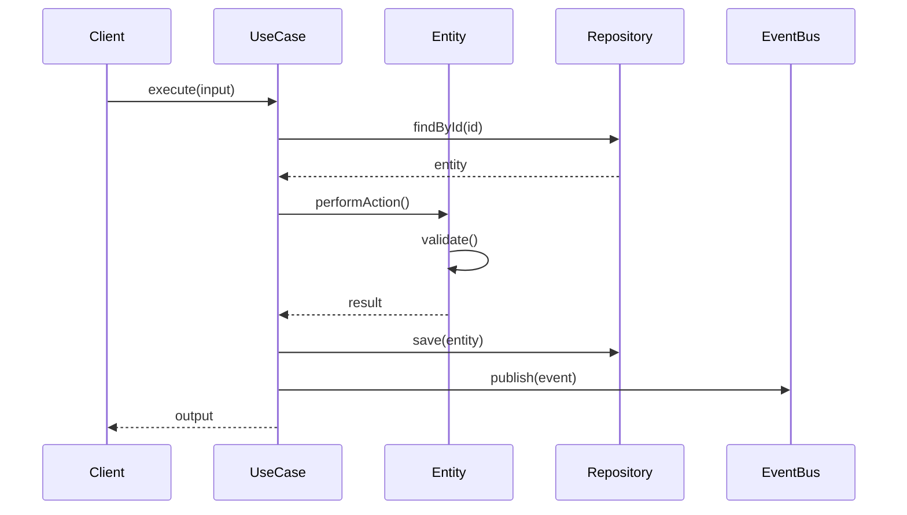
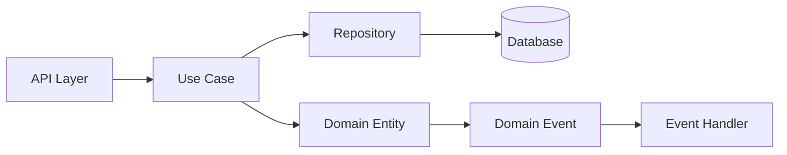

# Design Document: Message Timestamps Display

**Generated:** 2026-01-29T18:35:42.496Z

---

## Overview

**As a** user of the OEM Agent chat interface  

## Acceptance Criteria

1. **AC1:** Each message displays a timestamp showing when it was sent
2. **AC2:** Timestamp format is human-readable (e.g., "2:30 PM" or "Yesterday at 3:45 PM")
3. **AC3:** Timestamp is displayed consistently for both user and AI messages
4. **AC4:** Timestamp is shown in the user's local timezone
5. **AC5:** Hovering over timestamp shows full date and time

---

## Domain Model Design

### Entities

#### Message

```typescript
export class Message extends BaseEntity {
  // Properties
  private readonly _id: string;
  
  // Constructor
  constructor(props: MessageProps) {
    super();
    // TODO: Initialize properties
  }
  
  // Domain methods
  // TODO: Add business logic methods
  
  // Getters
  get id(): string {
    return this._id;
  }
}
```

**Responsibilities:**
- TODO: Define entity responsibilities
- TODO: Define invariants

**Domain Events:**
- TODO: List events emitted by this entity


### Value Objects

#### Timestamp

```typescript
export class Timestamp {
  private readonly _value: unknown;
  
  constructor(value: unknown) {
    this.validate(value);
    this._value = value;
  }
  
  private validate(value: unknown): void {
    // TODO: Validation logic
  }
  
  get value(): unknown {
    return this._value;
  }
  
  equals(other: Timestamp): boolean {
    return this._value === other._value;
  }
}
```

**Validation Rules:**
- TODO: Define validation rules


### Domain Events


---

## Application Layer Design

### Use Cases

#### LoadChatHistoryUseCase

```typescript
export class LoadChatHistoryUseCase {
  constructor(
    // TODO: Inject required repositories and services
  ) {}
  
  async execute(input: LoadChatHistoryUseCaseInput): Promise<LoadChatHistoryUseCaseOutput> {
    // TODO: Orchestrate domain operations
    // 1. Validate input
    // 2. Load aggregates
    // 3. Execute business logic
    // 4. Persist changes
    // 5. Emit events
    // 6. Return result
  }
}
```

**Input DTO:**
```typescript
interface LoadChatHistoryUseCaseInput {
  // TODO: Define input structure
}
```

**Output DTO:**
```typescript
interface LoadChatHistoryUseCaseOutput {
  // TODO: Define output structure
}
```

**Dependencies:**
- TODO: List required repositories
- TODO: List required services

**Flow:**
1. TODO: Step 1
2. TODO: Step 2
3. TODO: Step 3


#### MessageDTO

```typescript
export class MessageDTO {
  constructor(
    // TODO: Inject required repositories and services
  ) {}
  
  async execute(input: MessageDTOInput): Promise<MessageDTOOutput> {
    // TODO: Orchestrate domain operations
    // 1. Validate input
    // 2. Load aggregates
    // 3. Execute business logic
    // 4. Persist changes
    // 5. Emit events
    // 6. Return result
  }
}
```

**Input DTO:**
```typescript
interface MessageDTOInput {
  // TODO: Define input structure
}
```

**Output DTO:**
```typescript
interface MessageDTOOutput {
  // TODO: Define output structure
}
```

**Dependencies:**
- TODO: List required repositories
- TODO: List required services

**Flow:**
1. TODO: Step 1
2. TODO: Step 2
3. TODO: Step 3


---

## Sequence Diagrams

### Main Use Case Flow



---

## Data Flow



---

## Testing Strategy

### Unit Tests

**Domain Entities:**
- Test business logic in isolation
- Test invariant enforcement
- Test domain event emission

**Value Objects:**
- Test validation rules
- Test immutability
- Test equality

**Use Cases:**
- Test with mocked dependencies
- Test happy path
- Test error scenarios

### Integration Tests

- Test repository implementations
- Test use case with real dependencies
- Test event publishing and handling

---

## Implementation Notes

### DDD Principles

- Keep domain logic in entities/value objects
- Use cases orchestrate, don't contain business logic
- Repositories only for aggregate roots
- Domain events for decoupling

### Code Organization

```
packages/domain/src/
  ├── entities/
  │   └── Message.ts
  ├── value-objects/
  │   └── Timestamp.ts
  └── events/
      └── Event.ts

packages/application/src/
  └── use-cases/
      └── LoadChatHistoryUseCase.ts
```

---

**Next Step:** Generate test cases with `pnpm workflow:generate-tests`
