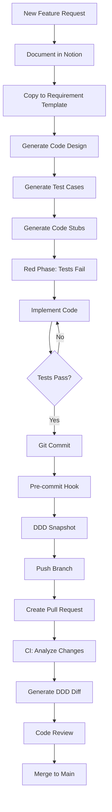

# Complete TDD Workflow Guide

**Created:** 2026-01-29  
**Purpose:** End-to-end guide for Scrum-based TDD workflow with DDD diagram versioning

---

## Overview

This workflow implements a complete Test-Driven Development (TDD) process integrated with:
- DDD architecture documentation
- Scrum methodology
- Git version control
- Automated PR preparation
- Code review assistance

---

## Workflow Architecture



---

## Complete Workflow Steps

### Step 1: Start New Feature

**Command:**
```bash
pnpm workflow:new-feature feature-name
```

**What happens:**
1. Creates `Business/Features/feature-name/` directory
2. Copies requirement template
3. Creates feature branch `feature/feature-name`

**Manual action required:**
- Fill out `Business/Features/feature-name/requirement.md`
- Include:
  - User story
  - Acceptance criteria
  - Domain/Application/Infrastructure changes
  - Link to Notion

---

### Step 2: Generate Design

**Command:**
```bash
pnpm workflow:generate-design feature-name
```

**What happens:**
1. Parses requirement document
2. Generates `design.md` with:
   - Entity/Value Object stubs
   - Use case flows
   - Sequence diagrams
   - Class diagrams
3. Creates `class-diagram.md`

**Output:**
- `Business/Features/feature-name/design.md`
- `Business/Features/feature-name/class-diagram.md`

**Review:**
- Verify design matches requirements
- Check DDD principles applied
- Ensure proper layer separation

---

### Step 3: Generate Test Cases (Red Phase)

**Command:**
```bash
pnpm workflow:generate-tests feature-name
```

**What happens:**
1. Parses design document
2. Generates test files:
   - `packages/domain/src/entities/__tests__/[Entity].test.ts`
   - `packages/domain/src/value-objects/__tests__/[VO].test.ts`
   - `packages/application/src/use-cases/__tests__/[UseCase].test.ts`
3. Creates `test-plan.md`

**Generated tests include:**
- Happy path scenarios
- Edge cases
- Error handling
- Business rule validation
- Domain event verification

---

### Step 4: Generate Code Stubs

**Command:**
```bash
pnpm workflow:generate-stubs feature-name
```

**What happens:**
1. Creates implementation files:
   - `packages/domain/src/entities/[Entity].ts`
   - `packages/domain/src/value-objects/[VO].ts`
   - `packages/application/src/use-cases/[UseCase].ts`
2. Stubs throw errors (tests should fail)

**Verify:**
```bash
pnpm test
# Should fail - this is expected (Red phase)
```

---

### Step 5: Implementation Phase (Green Phase)

**Manual work:**
1. Implement TODOs in generated files
2. Run tests frequently:
   ```bash
   pnpm test:watch
   ```
3. Make tests pass one by one
4. Refactor as needed (Green → Refactor phase)

**TDD Cycle:**
1. **Red:** Write test (or generated)
2. **Green:** Make test pass (minimum code)
3. **Refactor:** Improve code quality

**Verify:**
```bash
pnpm test --coverage
# All tests should pass
# Coverage should be >80%
```

---

### Step 6: Commit Changes

**Standard git workflow:**
```bash
git add .
git commit -m "feat: implement [feature-name]"
```

**What happens automatically (pre-commit hook):**
1. DDD snapshot generated
2. Diagrams saved to `docs/ddd-snapshots/[date]-[sha]/`
3. Snapshot auto-staged and included in commit
4. Lint-staged runs (formatting, linting)

**Naming convention:**
- `docs/ddd-snapshots/2026-01-29-abc123f/`
  - `metadata.json` - Commit info, changed files
  - All 9 DDD diagrams (.svg + .mmd)
  - `stats.json` - Model statistics

---

### Step 7: Create Pull Request

**Command:**
```bash
pnpm workflow:prepare-pr
```

**OR manual:**
```bash
pnpm workflow:prepare-pr --title "feat: user authentication" --base-branch main
```

**What happens:**
1. Runs all tests
2. Analyzes code changes (git diff)
3. Generates DDD diff diagrams:
   - Before/after side-by-side comparison
   - Saved to `docs/ddd-changes/PR-[number]/`
4. Identifies review focus areas
5. Populates PR template
6. Creates PR via GitHub CLI

**Output:**
- PR created on GitHub
- DDD diff diagrams in `docs/ddd-changes/PR-[number]/`
- `comparison.md` with side-by-side diagrams

---

### Step 8: Automated PR Validation (CI)

**Triggered automatically** when PR is opened.

**GitHub Action performs:**
1. Run tests with coverage
2. Run type checking
3. Validate DDD architecture rules
4. Generate DDD diff diagrams
5. Analyze code changes
6. Post comment on PR with:
   - Test results
   - Coverage report
   - DDD validation results
   - Link to DDD diff diagrams
   - Review checklist

**View:** GitHub Actions tab in PR

---

### Step 9: Code Review

**Reviewers use:**
1. **PR Template sections:**
   - Changes summary (auto-populated)
   - DDD impact (with diagrams)
   - Test results
   - Review checklist

2. **DDD Diff Diagrams:**
   - `docs/ddd-changes/PR-[number]/comparison.md`
   - Side-by-side Before/After SVG diagrams
   - Change indicators (green/yellow/red)

3. **Focus Areas:**
   - AI-identified critical code sections
   - Security-sensitive changes
   - Performance implications

**Review checklist:**
- [ ] Domain logic in correct layer
- [ ] Tests cover edge cases
- [ ] No breaking changes
- [ ] Documentation updated
- [ ] DDD principles followed

---

### Step 10: Merge

After approval:
```bash
# Via GitHub UI or CLI
gh pr merge [pr-number] --squash
```

**What happens:**
1. PR merged to main
2. CI regenerates main DDD docs (existing workflow)
3. Latest snapshot becomes new baseline

---

## Quick Reference Commands

### Start New Feature
```bash
pnpm workflow:new-feature my-feature
```

### Design & Development
```bash
pnpm workflow:generate-design my-feature
pnpm workflow:generate-tests my-feature
pnpm workflow:generate-stubs my-feature
pnpm test:watch  # Implement until green
```

### Commit & PR
```bash
git add .
git commit -m "feat: implement my-feature"
# Pre-commit hook auto-generates snapshot

pnpm workflow:prepare-pr
```

### DDD Operations
```bash
pnpm ddd:snapshot           # Manual snapshot
pnpm ddd:diff              # Generate diff diagrams
pnpm ddd:docs              # Update current docs
pnpm ddd:validate          # Validate architecture
```

---

## File Structure

### Generated per Feature

```
Business/Features/my-feature/
├── requirement.md          # From Notion (manual)
├── design.md              # Auto-generated
├── test-plan.md           # Auto-generated
└── class-diagram.md       # Auto-generated

packages/domain/src/
├── entities/
│   ├── MyEntity.ts        # Generated stub
│   └── __tests__/
│       └── MyEntity.test.ts
└── value-objects/
    ├── MyVO.ts
    └── __tests__/
        └── MyVO.test.ts

packages/application/src/use-cases/
├── MyUseCase.ts
└── __tests__/
    └── MyUseCase.test.ts
```

### Generated per Commit

```
docs/ddd-snapshots/
└── 2026-01-29-abc123f/
    ├── metadata.json
    ├── overview.svg
    ├── stakeholder-summary.svg
    ├── domain-model.svg
    └── ... (all 9 diagrams)
```

### Generated per PR

```
docs/ddd-changes/PR-123/
├── comparison.md          # Side-by-side comparison
├── diff-summary.json
├── before/
│   ├── domain-model.svg
│   └── ... (previous state)
└── after/
    ├── domain-model.svg
    └── ... (current state)
```

---

## Integration with Notion

### Manual Process (Current)

1. **In Notion:** Document requirement
   - User story
   - Acceptance criteria
   - Technical details

2. **Copy to repo:**
   ```bash
   pnpm workflow:new-feature my-feature
   # Fill Business/Features/my-feature/requirement.md
   # Paste from Notion
   ```

3. **Link back:**
   - Add Notion link in requirement.md
   - Add GitHub PR link in Notion

### Future: API Integration

Could automate with Notion API:
- Fetch requirements directly
- Auto-sync status
- Webhook triggers

---

## TDD Best Practices

### Red Phase (Write Tests)
- Write failing tests first
- Cover happy path + edge cases
- Test error scenarios
- Verify tests actually fail

### Green Phase (Make Tests Pass)
- Write minimum code to pass
- Don't over-engineer
- Keep it simple
- Commit frequently

### Refactor Phase
- Improve code quality
- Remove duplication
- Enhance readability
- Tests still pass

### DDD in TDD

**Domain Layer:**
```bash
# 1. Write entity test
# 2. Create entity stub
# 3. Implement business logic
# 4. Tests pass
```

**Application Layer:**
```bash
# 1. Write use case test (mocked)
# 2. Create use case stub
# 3. Orchestrate domain operations
# 4. Tests pass
```

**Infrastructure Layer:**
```bash
# 1. Write integration test
# 2. Implement repository/service
# 3. Tests pass
```

---

## Troubleshooting

### Tests won't run

```bash
# Check test configuration
pnpm test --help

# Run specific package
pnpm --filter @repo/domain test
```

### Pre-commit hook failing

```bash
# Run manually
pnpm ddd:snapshot

# Skip hook (not recommended)
git commit --no-verify
```

### DDD diff generation fails

```bash
# Ensure snapshots exist
ls docs/ddd-snapshots/

# Generate manually
pnpm ddd:diff --base-branch main
```

### PR preparation fails

```bash
# Check test status
pnpm test

# Check git status
git status

# Run steps manually
pnpm ddd:diff
```

---

## Examples

### Example 1: Add New Entity

**Requirement:** Add `Order` entity

**Steps:**
```bash
# 1. Start workflow
pnpm workflow:new-feature order-management

# 2. Fill requirement.md
# - Entity: Order (orderId, items, total, status)
# - Events: OrderCreated, OrderConfirmed

# 3. Generate design
pnpm workflow:generate-design order-management

# 4. Generate tests
pnpm workflow:generate-tests order-management

# 5. Generate stubs
pnpm workflow:generate-stubs order-management

# 6. Implement (make tests pass)
# Edit packages/domain/src/entities/Order.ts

# 7. Commit & PR
git commit -am "feat: add Order entity"
pnpm workflow:prepare-pr
```

**Result:**
- Tests passing
- DDD snapshot created
- PR with diff diagrams
- Code ready for review

---

### Example 2: Modify Existing Use Case

**Requirement:** Add filtering to `RecommendProductsUseCase`

**Steps:**
```bash
# 1. Create feature
pnpm workflow:new-feature product-filtering

# 2. Fill requirement (focus on changes)

# 3. Write tests first
# Manually edit: packages/application/src/use-cases/__tests__/RecommendProductsUseCase.test.ts
# Add new test cases for filtering

# 4. Implement
# Edit: packages/application/src/use-cases/RecommendProductsUseCase.ts

# 5. Verify
pnpm test

# 6. Commit & PR
git commit -am "feat: add product filtering"
pnpm workflow:prepare-pr
```

---

## DDD Diagram Versioning

### Automatic Snapshots

**When:** Every commit (via pre-commit hook)

**Contents:** Complete DDD diagram set with metadata

**Location:** `docs/ddd-snapshots/[date]-[sha]/`

**Use cases:**
- Track architecture evolution
- Compare changes over time
- Baseline for PR diffs

### PR Diff Diagrams

**When:** PR creation (via `pnpm workflow:prepare-pr`)

**Contents:** Side-by-side before/after comparison

**Location:** `docs/ddd-changes/PR-[number]/`

**Use cases:**
- Visual code review
- Architecture impact assessment
- Stakeholder communication

---

## Code Review with DDD Diagrams

### For Reviewers

1. **Start with DDD diff:**
   ```bash
   open docs/ddd-changes/PR-[number]/comparison.md
   ```

2. **Review visual changes:**
   - Green: New components
   - Yellow: Modified components
   - Red: Deleted components

3. **Focus on:**
   - Domain layer changes (business logic)
   - New aggregates (consistency boundaries)
   - Use case modifications (orchestration)

4. **Verify:**
   - DDD principles followed
   - Layer separation maintained
   - Tests cover changes

### Review Checklist

**Domain Layer:**
- [ ] Business logic in entities/VOs (not in use cases)
- [ ] Invariants enforced
- [ ] Domain events emitted
- [ ] No infrastructure dependencies

**Application Layer:**
- [ ] Use cases orchestrate only (thin)
- [ ] DTOs for boundary crossing
- [ ] Dependencies injected
- [ ] Error handling present

**Tests:**
- [ ] Written before implementation (TDD)
- [ ] Cover happy path + edge cases
- [ ] Mocks used appropriately
- [ ] Integration tests for critical flows

---

## CI/CD Integration

### Pre-commit Hook

**Trigger:** `git commit`

**Actions:**
1. Generate DDD snapshot
2. Run lint-staged (format, lint)
3. Stage snapshot files

**Skip (not recommended):**
```bash
git commit --no-verify
```

### PR Validation Workflow

**Trigger:** PR opened/updated

**Actions:**
1. Run tests + coverage
2. Type checking
3. DDD validation
4. Generate DDD diff
5. Post analysis comment on PR

**View:** GitHub Actions tab

### DDD Docs Update Workflow

**Trigger:** Push to main

**Actions:**
1. Regenerate `docs/ddd-models/`
2. Auto-commit updated docs

**Existing workflow:** `.github/workflows/ddd-docs.yml`

---

## Best Practices

### Requirements

1. **Be specific** in acceptance criteria
2. **List all** domain concepts needed
3. **Link to Notion** for full context
4. **Identify dependencies** early

### Design

1. **Follow DDD** patterns
2. **Keep aggregates small**
3. **Define clear boundaries**
4. **Document invariants**

### Testing

1. **Write tests first** (TDD)
2. **Test one thing** per test
3. **Use descriptive names**
4. **Mock external dependencies**
5. **Aim for >80% coverage**

### Implementation

1. **Make tests pass** (minimum code)
2. **Refactor** after green
3. **Commit frequently**
4. **Keep commits atomic**

### PR

1. **Run full test suite** before PR
2. **Generate DDD diff** diagrams
3. **Fill PR template** completely
4. **Self-review** before requesting
5. **Link to Notion** requirement

---

## Troubleshooting

### "Feature directory already exists"

```bash
# Use existing or delete
rm -rf Business/Features/my-feature
```

### "Design generation failed"

```bash
# Check requirement.md format
# Ensure domain concepts are marked with backticks: `EntityName`
```

### "Tests won't compile"

```bash
# Generate stubs first
pnpm workflow:generate-stubs my-feature

# Or create manually
```

### "Snapshot generation slow"

```bash
# Snapshots include all 18 files (9 .mmd + 9 .svg)
# This is expected - takes ~30-60s
# Skip if needed: git commit --no-verify
```

### "PR diff has no baseline"

```bash
# Need at least one commit with snapshot
# Make a commit first, then create PR from next commit
```

---

## Advanced Usage

### Custom Base Branch

```bash
pnpm workflow:prepare-pr --base-branch develop
```

### Draft PR

```bash
pnpm workflow:prepare-pr --draft
```

### Manual DDD Diff

```bash
pnpm ddd:diff --base-branch main --pr-number 123
```

### Skip Snapshot Generation

```bash
# Not recommended, but possible
git commit --no-verify
```

---

## Migration Guide

### For Existing Features

1. **Create requirement doc:**
   ```bash
   mkdir -p Business/Features/existing-feature
   cp templates/scrum/requirement-template.md Business/Features/existing-feature/requirement.md
   ```

2. **Document retroactively:**
   - Fill what was implemented
   - Link to original Notion/ticket

3. **Generate snapshot:**
   ```bash
   git commit --allow-empty -m "chore: create DDD snapshot"
   # Pre-commit hook creates snapshot
   ```

---

## Related Documentation

- [DDD Models README](./ddd-models/README.md) - Auto-generated DDD docs
- [DDD Visualization](./DDD_VISUALIZATION.md) - dependency-cruiser
- [Architecture](./ARCHITECTURE.md) - System architecture
- [.cursorrules](../.cursorrules) - Development rules

---

## Workflow Diagram Legend

**Symbols:**
- 🚀 Command to run
- ✅ Success checkpoint
- 📝 Manual action required
- 🤖 Automated process
- 📊 Generated output

---

## Support

**For workflow issues:**
1. Check this guide
2. Review error messages
3. Check `docs/ddd-snapshots/` for snapshots
4. Verify `Business/Features/[name]/` structure

**For DDD questions:**
1. Review [DDD Models README](./ddd-models/README.md)
2. Check `.cursorrules` for DDD principles
3. Review [Architecture](./ARCHITECTURE.md)

---

**Workflow Version:** 1.0  
**Last Updated:** 2026-01-29  
**Status:** Production Ready
