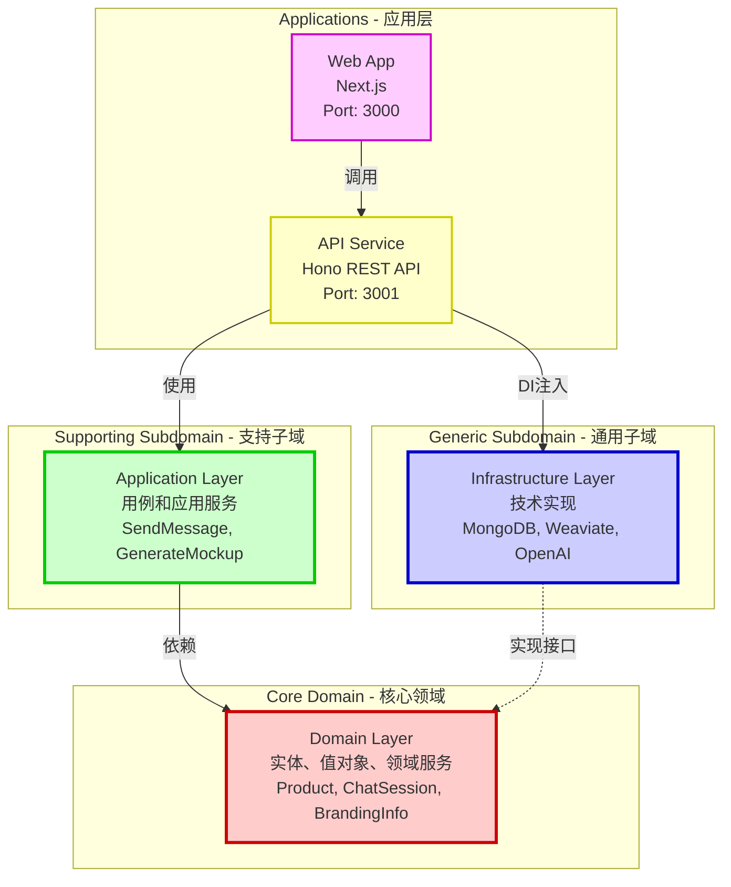
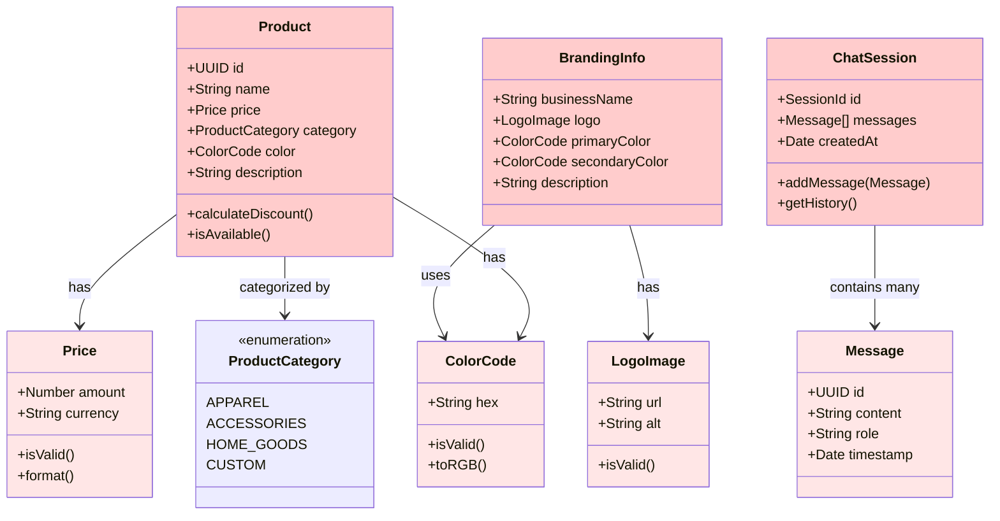
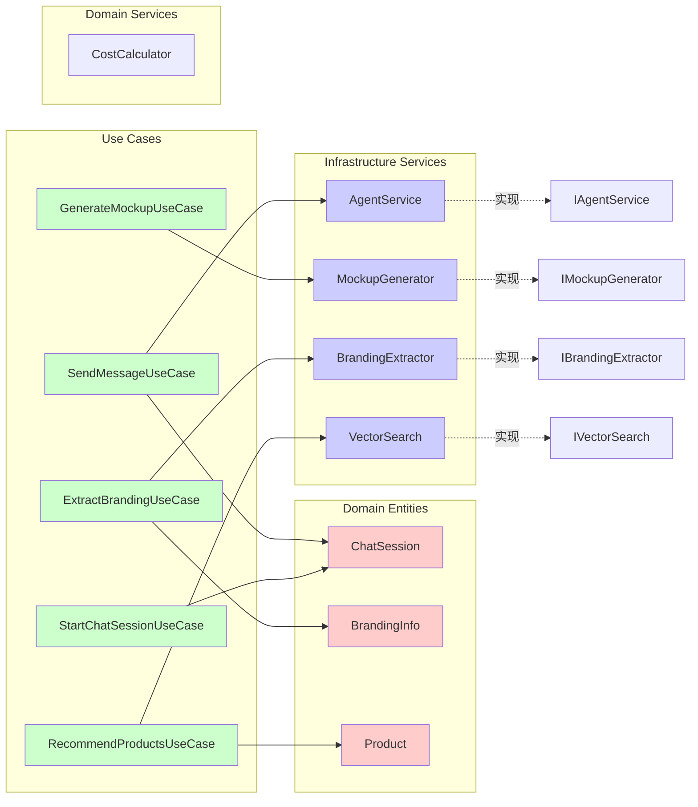
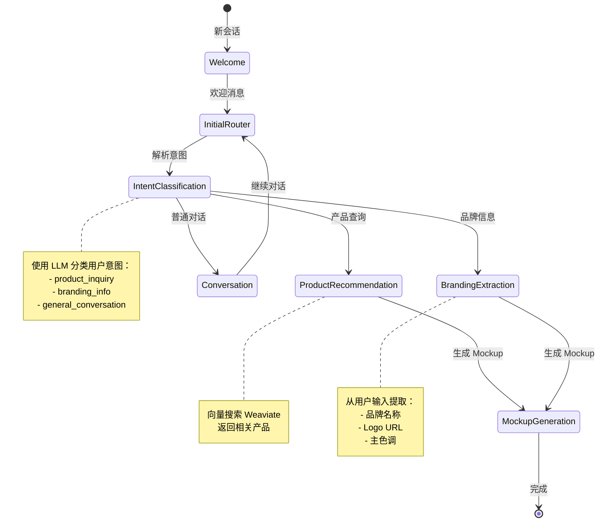
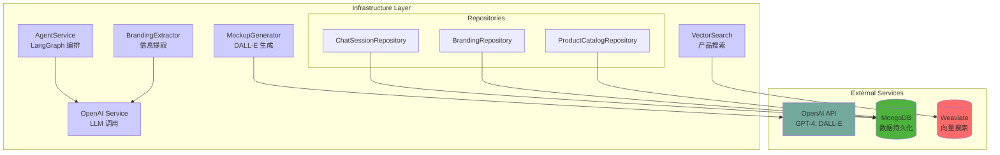
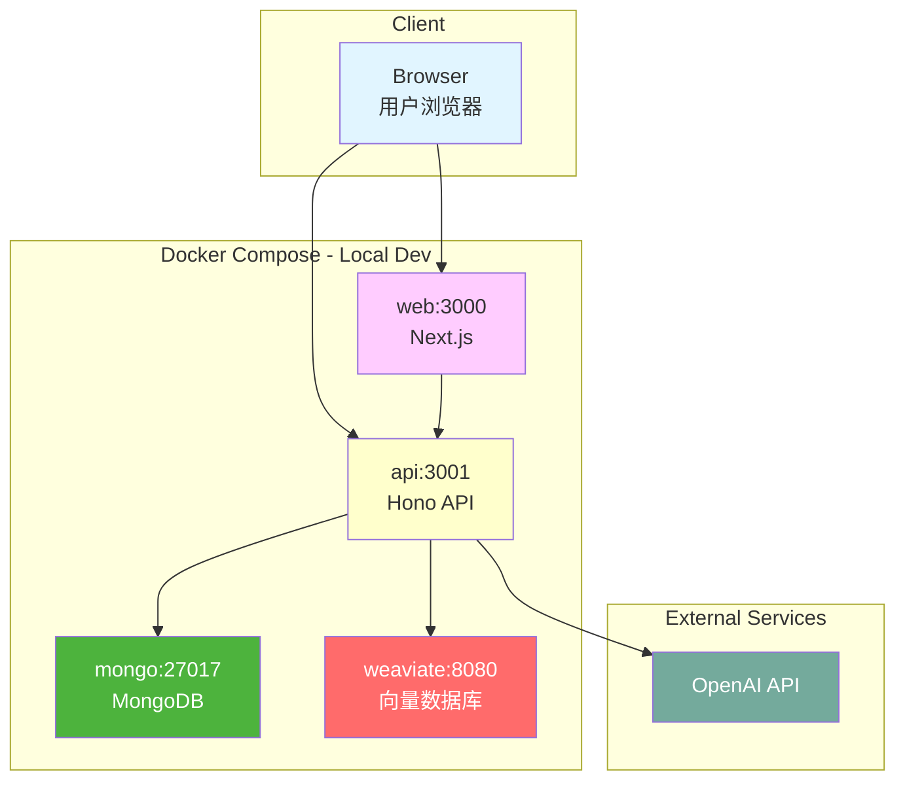

# DDD 战略设计图

基于项目的 DDD 架构手工绘制的战略设计图。

---

## 架构层级关系



---

## 领域模型关系



---

## 核心用例流程

### 发送消息用例

```mermaid
sequenceDiagram
    actor User
    participant Web as Web App
    participant API as API Server
    participant UC as SendMessageUseCase
    participant Session as ChatSession
    participant Agent as AgentService
    participant LangGraph as LangGraph
    
    User->>Web: 输入消息
    Web->>API: POST /api/sessions/{id}/messages
    API->>UC: execute(sessionId, message)
    UC->>Session: addMessage(message)
    UC->>Agent: processMessage(session)
    Agent->>LangGraph: 执行对话流程
    
    alt 产品推荐
        LangGraph->>LangGraph: intentClassificationNode
        LangGraph->>LangGraph: productRecommendationNode
    else 品牌提取
        LangGraph->>LangGraph: brandingExtractionNode
    else 生成 Mockup
        LangGraph->>LangGraph: mockupGenerationNode
    else 普通对话
        LangGraph->>LangGraph: conversationNode
    end
    
    LangGraph-->>Agent: 响应流
    Agent-->>UC: 结果
    UC-->>API: DTO
    API-->>Web: SSE Stream
    Web-->>User: 实时显示
    
    style User fill:#e1f5ff
    style Session fill:#ffcccc
    style LangGraph fill:#ccccff
```

---

## 应用服务依赖图



---

## LangGraph 状态流转



---

## 基础设施依赖



---

## 部署架构



---

## 说明

这些图表是手工编写的，用于：
- 📚 **文档说明** - 在 README 和设计文档中使用
- 👥 **团队沟通** - 新成员 onboarding
- 🎯 **架构决策** - ADR (Architecture Decision Record)
- 📊 **演示展示** - 向 stakeholder 解释架构

### 查看方式

1. **GitHub** - 直接在 GitHub 上查看此文件，Mermaid 会自动渲染
2. **VS Code** - 安装 Markdown Preview Mermaid 插件
3. **在线** - 复制代码到 https://mermaid.live/

### 更新

这些图表需要手动更新。当架构发生变化时，请及时更新对应的图表。

---

**相关文档：**
- [DDD_MERMAID_GUIDE.md](../DDD_MERMAID_GUIDE.md) - Mermaid 完整指南
- [DDD_VISUALIZATION.md](../DDD_VISUALIZATION.md) - 可视化工具文档
- [ARCHITECTURE.md](../ARCHITECTURE.md) - 架构文档
